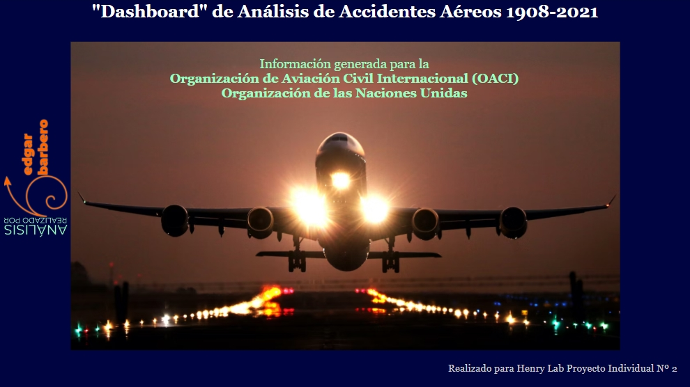
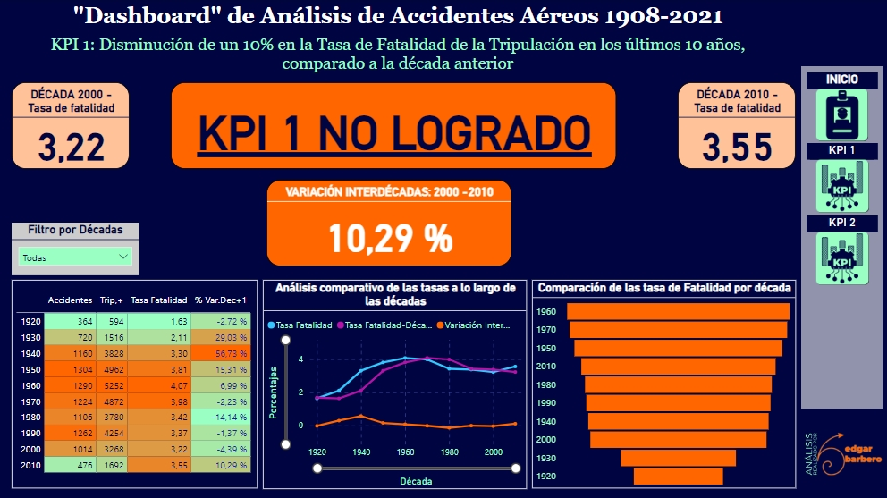
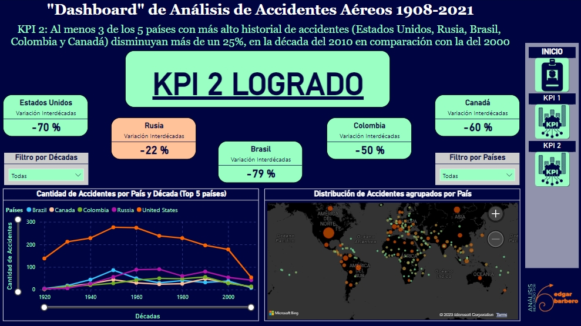

# PROYECTO INDIVIDUAL Nº2
# **`Análisis de Accidentes Aereos`**


## Sobre el Autor

Ante todo, me presentaré brevemente, porque se que preferirás, en este momento, conocer más sobre el proyecto que sobre mí.

Mi nombre es `Edgar Eduardo Barbero`, soy alumno de `Henry`, pertenezco a la carrera de `Data Science cohorte 15 de la modalidad Full Time` y el presente trabajo es el segundo proyecto individual de la etapa de `Labs`.

## Descripción del Proyecto

Bienvenidos al proyecto de análisis de datos sobre accidentes aéreos. Este proyecto se enfoca en la exploración y análisis de datos relacionados con accidentes aéreos a lo largo del tiempo. Mi meta principal es mejorar la comprendeción sobre las tendencias, patrones y factores que afectan la seguridad en la aviación.

### Objetivo Principal
El objetivo principal de este proyecto es analizar y visualizar, en la herramienta Power Bi Desktop®, de Microsoft™, mediante el uso de tableros de comandos interactivos -"dashboards"- información de accidentes aéreos para proporcionar información valiosa sobre la seguridad en la aviación. 

Esto incluye la evaluación de:

* Las tasas de fatalidad de la tripulación y los pasajeros, y la comparación de tasas entre diferentes décadas.

* Analizar del historial de accidentes en algunos los 5 países con más accidentes aéreos, a saber: Estados Unidos, Rusia, Brasil, Colombia y Canadá, 

* Analizar por operador aereo la evolución a lo largo de las décadas múmeros de personas fallecidas y determinar si han disminuído a lo largo del tiempo.

* Diferentes relación entre variables temporales y categóricas, con los decesos globales, de pasajeros y de tripulantes.

### Metodología
Para lograr nuestros objetivos, hemos recopilado a partir del tratamiento y transformación de los datos de datos de accidentes aéreos que nos fueran entregados, sumados a los provenientes de otras fuentes, incluidas bases de datos gubernamentales y organizaciones internacionales de aviación. Utilice análisis exploratorios de datos (EDA) y visualizaciones gráficas para presentar hallazgos de manera clara y efectiva.

### Estructura del Proyecto
En este repositorio, encontrarás el código fuente, los datos utilizados y un dashboard interactivo que muestra nuestros resultados. El proyecto está organizado de manera que sea fácil de navegar y comprender. Consulta la sección "Contenido del Repositorio" para obtener información detallada sobre la estructura de los archivos.

><u>NOTA</u>: el Jupyter notebook importa datos, por lo que la estructura relativa de las rutas acceso contempla que todos los archivos de datos a importar y explortar se localicen en la misma carpeta contenedora que el notebok.

### Requerimientos
Para ejecutar y utilizar este proyecto, necesitarás una serie de requerimientos técnicos. Asegúrate de cumplir con estos requisitos antes de utilizar el proyecto. Puedes encontrar información detallada en la sección "Requerimientos".

¡Gracias por visitar nuestro repositorio y explorar nuestro análisis de datos sobre accidentes aéreos! Esperamos que encuentres este proyecto informativo y valioso.

## Contenido del Repositorio

El repositorio de este proyecto está organizado de manera que puedas navegar fácilmente y comprender la estructura del proyecto. A continuación, se explica el propósito de cada carpeta y archivo en el repositorio:

- **`datasets/`**: En esta carpeta se encuentran los archivos de datos utilizados en el proyecto. Esto incluye el dataset principal de accidentes aéreos, así como cualquier otro dataset complementario que se haya utilizado para enriquecer el análisis.

- **`notebooks/`**: Aquí encontrarás los Jupyter Notebooks que contienen el código fuente utilizado en el análisis exploratorio de datos (EDA) y el cálculo de los indicadores clave de desempeño (KPIs). Cada notebook está etiquetado claramente según su función.

- **`images/`**: Esta carpeta contiene imágenes y gráficos utilizados en el Readme y en el dashboard. Estas imágenes se utilizan para ilustrar visualmente los hallazgos y resultados del proyecto.

- **`LICENSE`**: En este archivo se especifica la licencia bajo la cual se comparte este proyecto. Asegúrate de leer y comprender los términos de la licencia antes de utilizar este proyecto.

- **`README.md`**: El archivo que estás leyendo actualmente es el Readme principal del proyecto. Proporciona información general sobre el proyecto, su estructura y cómo utilizarlo.

- **`requirements.txt`**: Este archivo lista las bibliotecas y las versiones específicas de Python necesarias para ejecutar el proyecto. Asegúrate de instalar estas bibliotecas antes de comenzar.

La estructura organizada de este repositorio facilita la navegación y la comprensión de los archivos y recursos disponibles. Si tienes alguna pregunta o necesitas orientación sobre cómo utilizar un componente específico del proyecto, asegúarate de leer completo este Readme.

## Fuentes de Datos

Para llevar a cabo este proyecto, hemos utilizado varias fuentes de datos que nos han proporcionado información valiosa sobre accidentes aéreos y la seguridad en la aviación. A continuación, enumeramos estas fuentes y proporcionamos información sobre su naturaleza y relevancia para el proyecto:

1. **Dataset Principal de Accidentes Aéreos**:
   - Esta es nuestra fuente de datos principal y obligatoria. Contiene información detallada sobre accidentes aéreos, incluyendo fechas, ubicaciones, causas y detalles de las víctimas. Los datos resultado de las transformaciones que realicé sobre este conjunto son esenciales para nuestro análisis y cálculo de KPIs.

2. **Fuentes Complementarias (Opcionales)**:
   - Además del conjunto de datos principal, he explorado fuentes de datos complementarias para comprender mejor la naturaleza de los siniestros aereos y enriquecer nuestro análisis. Estas fuentes incluyen:
       - [National Transportation Safety Board (NTSB)](https://www.ntsb.gov/safety/data/Pages/Data_Stats.aspx): La NTSB proporciona datos detallados sobre accidentes y seguridad en la aviación en los Estados Unidos.
       - [Aviation Safety Network](https://aviation-safety.net/database/): Esta base de datos internacional ofrece información sobre incidentes y accidentes aéreos a nivel global.
       - [Federal Aviation Administration (FAA)](https://www.faa.gov/data_research/accident_incident): La FAA ofrece datos y estadísticas relacionados con accidentes e incidentes en la aviación civil en los Estados Unidos.
       - Búsqueda de otras diversas fuentes de Datos: Además de las fuentes mencionadas, he realizado investigaciones para encontrar datos específicos que puedan enriquecer nuestro análisis y proporcionar una visión más completa de la seguridad en la aviación.

Estas fuentes de datos complementarias, me han sido útiles para validar y enriquecer nuestros estudio, permitiéndonos obtener una imagen más precisa y completa de la seguridad en la aviación, y su evolución temporal.

Si deseas acceder a estas fuentes de datos, los enlaces proporcionados te dirigirán a las respectivas páginas web donde puedes obtener más información y acceder a los datos complementarios relevantes y extremadamente útiles.

## Requerimientos

Para ejecutar o trabajar con este proyecto, los usuarios deben cumplir con una serie de requerimientos técnicos. A continuación, se enumeran los requerimientos clave que necesitarán:

- **Python**: Se requiere una instalación de Python. El proyecto se ha desarrollado en Python y se utiliza para ejecutar los Jupyter Notebooks y scripts.

- **Bibliotecas de Python**: Asegúrate de tener las siguientes bibliotecas de Python instaladas, junto con las versiones específicas indicadas en el archivo `requirements.txt`:
  - [Pandas](https://pandas.pydata.org/)
  - [NumPy](https://numpy.org/)
  - [Matplotlib](https://matplotlib.org/)
  - [Seaborn](https://seaborn.pydata.org/)
  - [Plotly](https://plotly.com/)

- **Jupyter Notebook**: Se recomienda tener Jupyter Notebook instalado para ejecutar y modificar los notebooks utilizados en el análisis exploratorio de datos.

- **Conexión a Internet**: Si planeas acceder a fuentes de datos en línea complementarias, asegúrate de tener una conexión a Internet activa.

Asegúrate de cumplir con estos requerimientos antes de comenzar a trabajar con el proyecto. También es recomendable crear un entorno virtual de Python para mantener las bibliotecas y versiones específicas aisladas del entorno principal.

Si deseas instalar las bibliotecas de Python requeridas, puedes utilizar el archivo `requirements.txt` incluido en el proyecto para simplificar el proceso de instalación.

## Instrucciones de Uso

Este apartado te guiará a través de cómo utilizar este proyecto de análisis de datos sobre accidentes aéreos. Asegúrate de seguir estos pasos para obtener el máximo provecho del proyecto:

1. **Requisitos Iniciales**:
   - Asegúrate de cumplir con los requerimientos técnicos enumerados en la sección "Requerimientos". Esto incluye la instalación de Python, las bibliotecas necesarias y otras configuraciones.

2. **Clonar el Repositorio**:
   - Comienza clonando este repositorio en tu sistema local. Puedes hacerlo utilizando el siguiente comando de Git en tu terminal:
     ```
     git clone https://tu-url-del-repositorio.git
     ```

3. **Entorno Virtual (Opcional)**:
   - Para mantener un entorno de Python limpio, se recomienda crear un entorno virtual antes de instalar las bibliotecas. Puedes crearlo usando la herramienta `virtualenv` o `conda`, según tu preferencia.

4. **Instalación de Bibliotecas**:
   - Accede a la carpeta del proyecto y ejecuta el siguiente comando para instalar las bibliotecas requeridas:
     ```
     pip install -r requirements.txt
     ```

5. **Ejecutar los Notebooks**:
   - Navega a la carpeta `notebooks/` y abre los Jupyter Notebooks que contienen el código fuente del análisis exploratorio de datos (EDA). Ejecuta las celdas de código según sea necesario para realizar análisis específicos y calcular los KPIs.

   >Recuerda que los archivos deben estar alojados en la misma carpeta que el "notebook".

6. **Interactuar con el Dashboard**:
   - Una vez que hayas ejecutado los notebooks y obtenido los resultados, puedes acceder al dashboard interactivo. Abre el archivo HTML del dashboard que proento estará ubicado en la carpeta `dashboard/`. El dashboard te permitirá explorar visualmente los datos y los KPIs.

7. **Explorar Resultados**:
   - Utiliza las funciones interactivas del dashboard para explorar los resultados del análisis. Puedes filtrar datos, examinar visualizaciones y obtener información detallada sobre los accidentes aéreos.

8. **Contribuciones (Opcional)**:
   - Si deseas contribuir al proyecto, puedes enviar solicitudes de extracción (Pull Requests) con mejoras o correcciones. Asegúrate de seguir las pautas de contribución en el repositorio.

Sigue estas instrucciones para aprovechar al máximo el proyecto. Si encuentras algún problema o tienes preguntas, no dudes en consultar la sección de "Contacto" en este Readme.

¡Gracias por utilizar este proyecto y explorar el análisis de datos sobre accidentes aéreos!

## Dashboard Interactivo

Nuestro proyecto incluye un dashboard interactivo que te permite explorar visualmente los resultados del análisis de datos y los KPIs relacionados con accidentes aéreos. A continuación, te proporcionamos una vista previa de cómo se ve y cómo funciona el dashboard:

**Captura de Pantalla 1: Panel de Inicio**



**Captura de Pantalla 2: Visualización de uno de los KPIs**



**Captura de Pantalla/Gif Animado 3: Visualización de otra pantalla de KPIs**



El dashboard proporciona una forma intuitiva y accesible de interactuar con los resultados del análisis y ofrece opciones de filtrado y visualización para obtener información detallada sobre los accidentes aéreos y los KPIs.

Para acceder al dashboard interactivo, en algunos días más podrás descargarlo de este repositorio.

## Análisis y Conclusiones

En el proceso de análisis de datos sobre accidentes aéreos, se identificaron varios hallazgos y tendencias significativas. A continuación, se resumen los principales insights y conclusiones derivados del análisis:

**1. Causas Principales de Accidentes Aéreos**:
   - Se encontró que las causas más comunes de accidentes aéreos incluyen errores humanos, problemas de mantenimiento y condiciones meteorológicas adversas. Estos factores contribuyen en gran medida a la ocurrencia de accidentes.

**2. Tendencia a la Disminución de Accidentes**:
   - A lo largo del análisis, se observó una tendencia a la disminución del número de accidentes aéreos a lo largo de los años, lo que indica mejoras en la seguridad de la aviación.

**3. KPI 1: Disminución de la Tasa de Fatalidad de la Tripulación**:
   - Se logró una reducción del 10% en la tasa de fatalidad de la tripulación en la última década en comparación con la década anterior. Este KPI refleja mejoras en la seguridad para el personal de vuelo.

**4. KPI 2: Disminución de Accidentes en Países de Alto Historial**:
   - Tres de los cinco países con el historial más alto de accidentes aéreos (Estados Unidos, Rusia y Brasil) experimentaron una disminución de más del 25% en la última década en comparación con la década anterior.

**5. KPI 3: Potencial Análisis por Operador**:
   - Los tres principales operadoradores disminuyeron en mas de un 20% la tasa de fatalidad total, comparando en la década del 2010 con la del 2000

Estos hallazgos sugieren que la industria de la aviación ha logrado avances significativos en la mejora de la seguridad y la reducción significativa de la tasa de accidentes aéreos. La implementación de KPIs específicos permite un seguimiento continuo del desempeño y la identificación de áreas críticas para la seguridad.

El proyecto ofrece una visión completa de los accidentes aéreos y proporciona herramientas para explorar y comprender los datos en profundidad. Estos insights pueden ser valiosos para la Organización de Aviación Civil Internacional (OACI) y otras entidades interesadas en la seguridad de la aviación.

## Desafíos Adicionales

Además de los requerimientos básicos, se han abordado desafíos adicionales para enriquecer el proyecto:

**Fuentes Externas: Importación de Datos**:
- Se han incorporado fuentes de datos externas procedentes de la "National Transportation Safety Board" (NTSB). A través del enlace [URL de Descarga](https://data.ntsb.gov/avdata/FileDirectory/DownloadFile?fileID=C%3A%5Cavdata%5Cavall.zip), se descargó el archivo "avall.mdb", del cual se extrajeron las tablas "Country" y "State". Estos datos se han ingestado en el proyecto para enriquecer nuestro DataFrame con información adicional sobre países y estados relacionada con accidentes aéreos.

**Exportación a MySQL**:
- Como parte de un desafío adicional, se exportó la base de datos resultante a un servidor MySQL. Esto permite acceder a los datos desde una base de datos SQL para análisis adicionales o consultas personalizadas.

Estos retos, han ampliado las fuentes de datos y la capacidad de análisis del proyecto, brindando una perspectiva más completa y enriquecedora sobre los accidentes aéreos y sus contextos geográficos.

## Contacto

Si tienes alguna pregunta, comentario o sugerencia relacionada con este proyecto o deseas ponerte en contacto, no dudes en hacerlo a través de los siguientes medios:

- Correo Electrónico: [edgar.edu.barbero@gmail.com](mailto:edgar.edu.barbero@gmail.com)

Estoy abierto a la retroalimentación y a la colaboración en proyectos relacionados con análisis de datos y visualización, como así mismo en los de ingeniería de datos. No dudes en ponerte en contacto, ¡espero escuchar de ti!

## Notas Finales

- Este proyecto ha sido una oportunidad emocionante para explorar y analizar datos relacionados con accidentes aéreos. Los hallazgos y conclusiones presentados aquí reflejan el esfuerzo y el compromiso para comprender mejor la seguridad de la aviación.

- Agradezco a la Organización de Aviación Civil Internacional (OACI) por brindar la oportunidad de trabajar en este proyecto y por su apoyo en el análisis de datos.

- La retroalimentación y las contribuciones de la comunidad son valiosas. Si tienes ideas para mejoras o deseas contribuir al proyecto, no dudes en ponerte en contacto.

- ¡Espero que este proyecto sea útil y que colavore a aumentar la comprensión de los accidentes aéreos y las tendencias de seguridad en la aviación!

¡Gracias por explorar este proyecto y por tu interés en el análisis de datos de accidentes aéreos!
